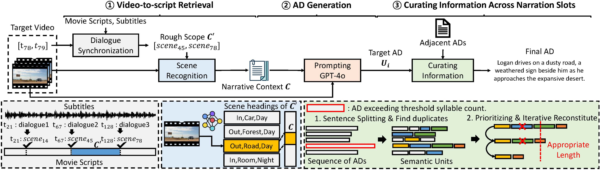
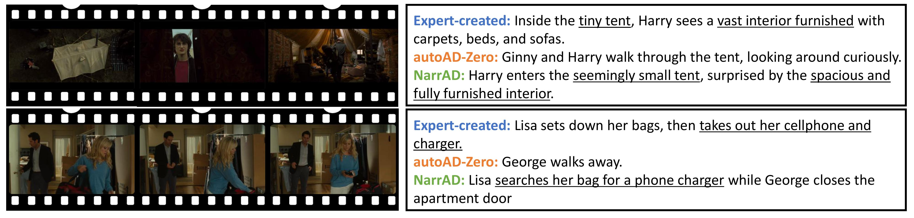

# NarrAD (WACV 2025 Oral)
This is an official Github repository for WACV'25 paper. **NarrAD: Automatic Generation of Audio Descriptions for Movies with Rich Narrative Context**.   



## Results
Here are the qualitative results of NarrAD.


You can check out several demo videos here: [https://bit.ly/4aSwOTr].   
You can check out full outputs on the MAD evaluation set here: [https://drive.google.com/drive/folders/1PIjL6qpZt4D2nxQwwMD7iZ9xmlfjRiuh?usp=drive_link].   


## Data Preparation
- Download the MAD dataset from https://github.com/Soldelli/MAD and place the `mad-v2-ad-named.csv` file to `datasets` directory, renaming it to `MAD_train.csv`.
- Movie frames are saved in the format `frame_000000.png` in the `videos/{movie}` directory. Due to file size constraints, only frames for selected samples are provided.
- Movie scripts used for AD creation can be found in the `scripts` directory. We have pre-parsed the movie scripts and generated `lines.csv`, `stage_directions.txt`, and `scenes.csv`.
- `transcribe.csv` has been pre-generated using the Google Cloud API.
- Prompts for using GPT can be found in the `prompts` directory, and the generated results are saved in the `results` directory.

## How to run?
- `ROOT_DIR` refers to the root directory of the project.
- `API_KEY` refers to your openai api key
### 1. Dialogue synchronization
```
python src/main.py --rootdir $ROOT_DIR --api_key $API_KEY --task synchronize
```
### 2. AD Generation
```
python src/main.py --rootdir $ROOT_DIR --api_key $API_KEY --task generate
```
### 3. AD Curation
```
python src/main.py --rootdir $ROOT_DIR --api_key $API_KEY --task curate
```
